# Blogger 

### Demonstration of a simple blogging system

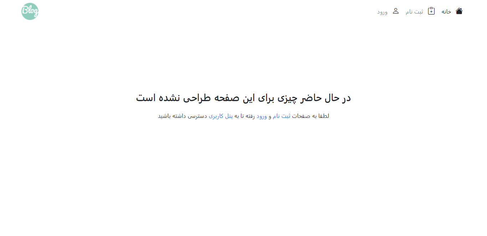
> this project has used session ,access controlling, file uploading, commenting system, view count system and many more features that we tried to demonstrate some of them in the rest of this page.

## Basic Features
- registration and login pages   

  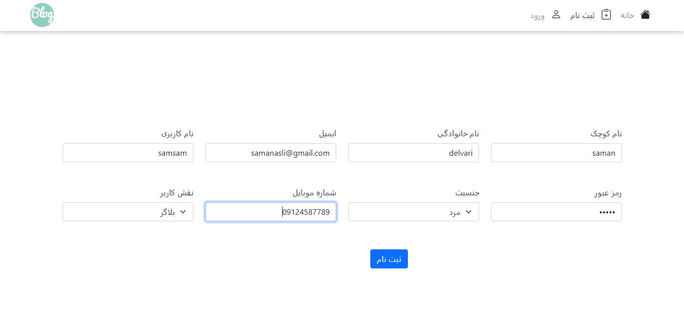
  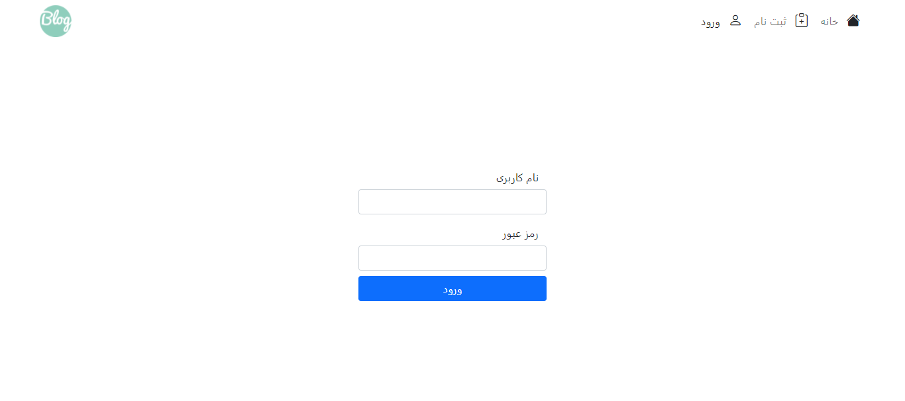

  > no one is able to see any article unless they are registerd 

- Dashboarding system which gives bloggers and admins whole different features

## Blogger features:
 - Changing personal information 

   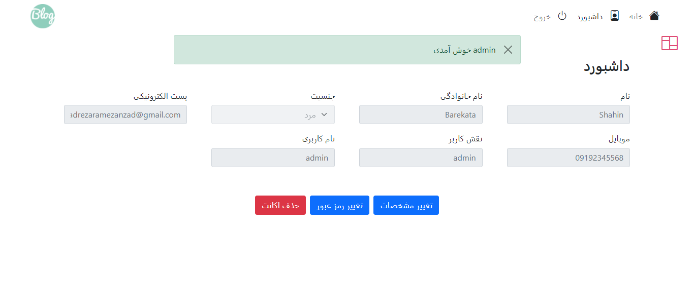

 - add profile picture   
  
   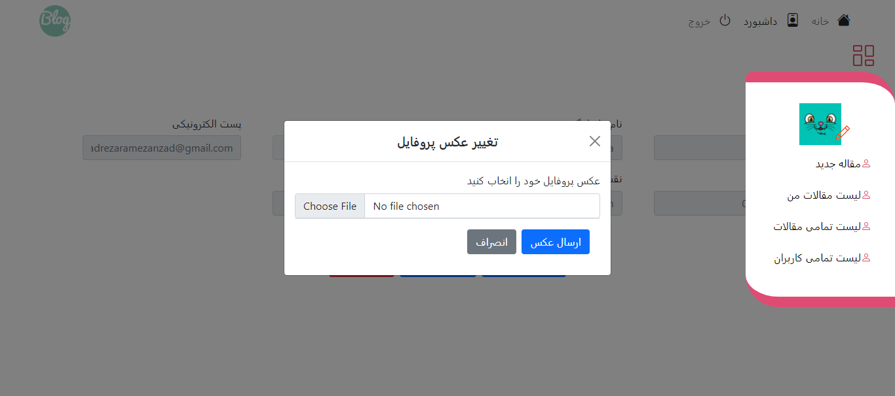

 - deleting account
 - changing password
  
   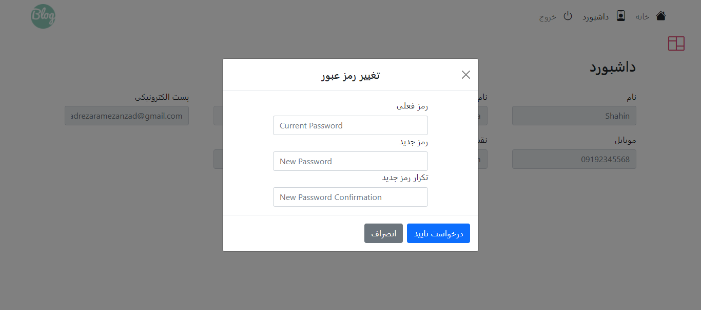

 - adding new articles
    
    

    > all article inputs will be checked both on server and client-side

    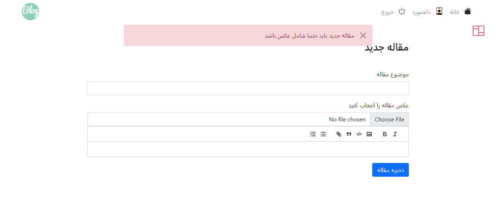

- get a list of all articles of your own or others (other users plus yourself) on different pages
  
  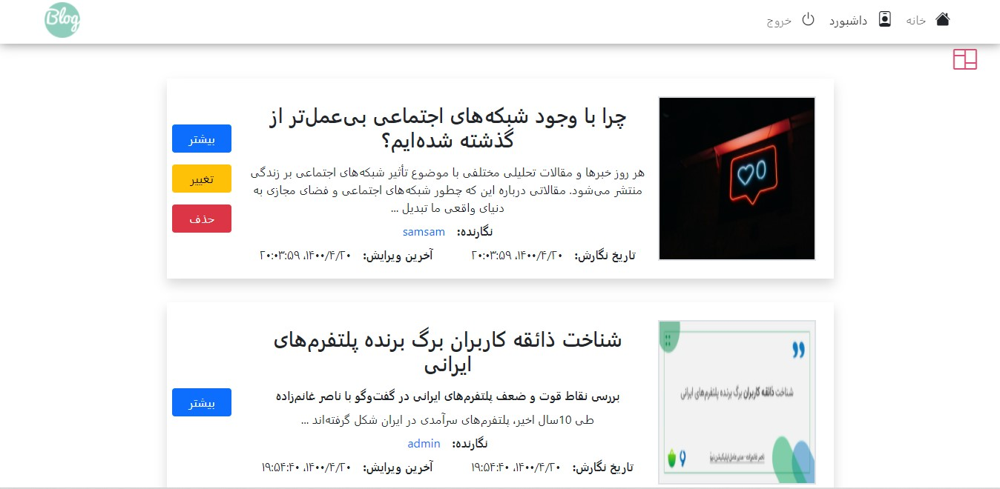
  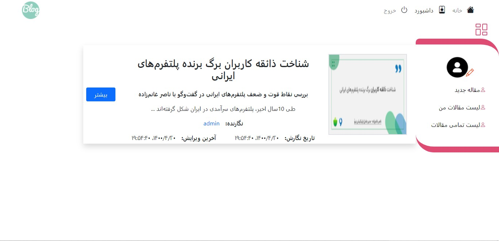

  > users are able to edit and delete their own articles

### while reading articles you can:

- edit or delete your own article
- comment on your own or others' articles
  
  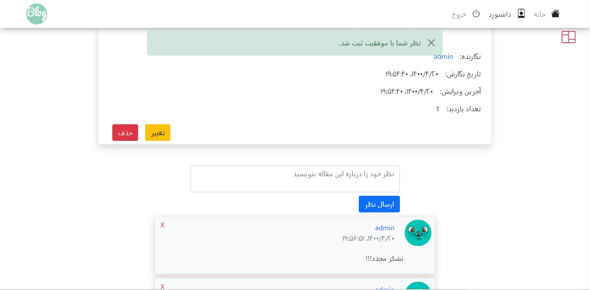
  > you can also delete your own comments

  

## Admin Features
> note: there is only one admin (GOD)  

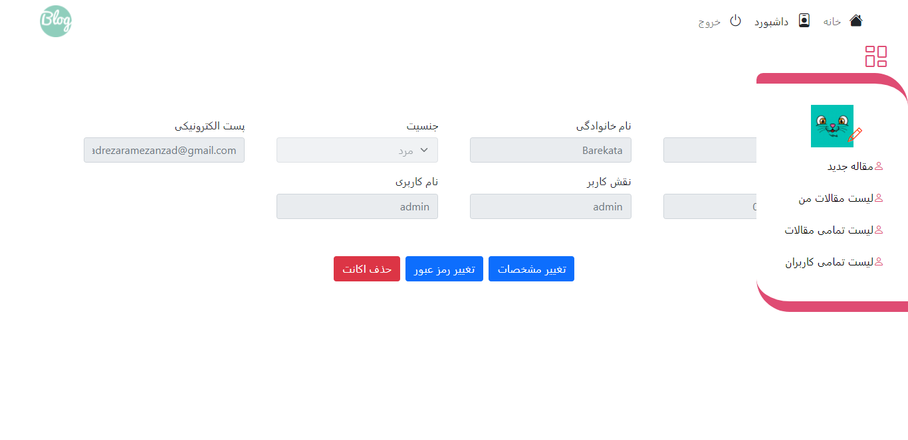

in addition to all general featuers admin has special access to: 
- admin can see a list of all users 
    
  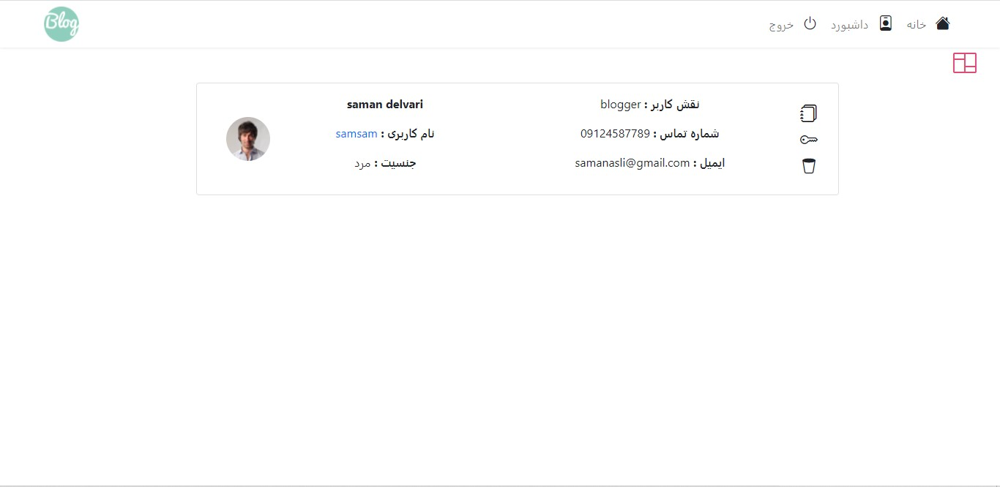

  - password reset
    > in users list page admin can reset each users password to auto generate a new password and sent it to users email
  - see all articles of specific user
    > admin can delete any users' articles
    
    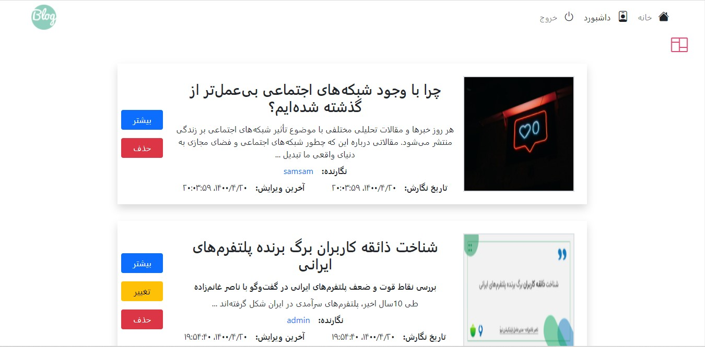

  - another special access for admin is to delete comments of any user

  - delete a users account
  

## Extra features 
- there is a simple yet powerfull system of ***view counting*** which shows how many unique readers were spending time on each specific article.
- when adding artiles they will be checked to get correct inputs and if any of them are incorrect and empty, a proper alert will pop up.
- as a server feature on deletion of articles their respective comments and files like pictures will be removed automatically.
- as a server feature when a user gets deleted, all respective properties like articles, comments and files like avatar pictures will also get removed.

> HOPE YOU ENJOYED IT. 💖